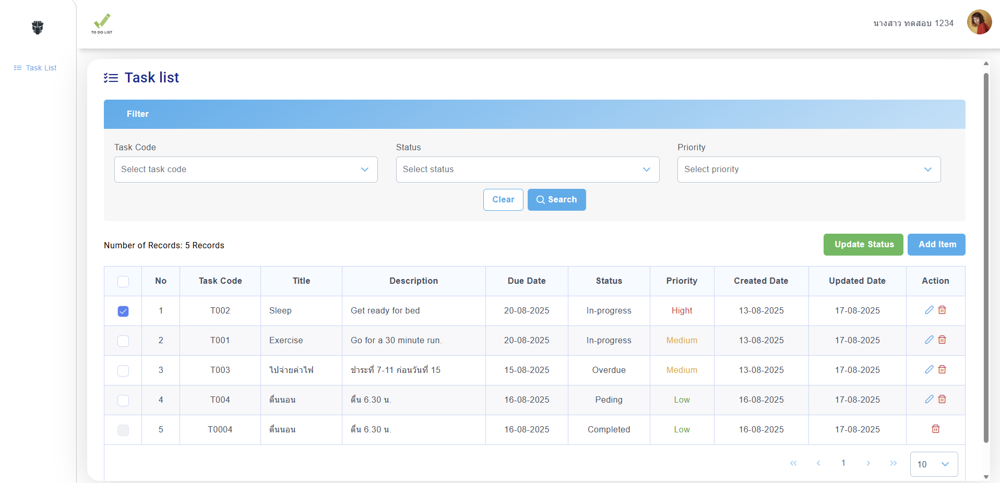
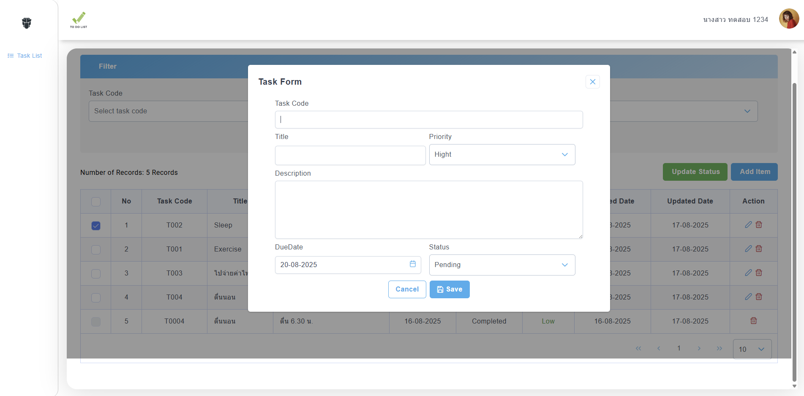

# FeToDoList

<div align="center">
  
  <br>
</div>


# Features
<li><strong>Create Tasks: </strong>Add new tasks with titles, priority, descriptions due date and status.</li>
<li><strong>Edit Tasks: </strong>Edit tasks with titles, priority, descriptions due date and status.</li>
<li><strong>Delete Tasks: </strong>Delete unwanted tasks.</li>
<li><strong>Edit Tasks: </strong>Edit tasks with titles, priority, descriptions due date and status.</li>
<li><strong>Checkbox: </strong>Only tasks that are not in completed status can be marked.</li>
<li><strong>Update Status: </strong>Update the status of the task that has been checked to completed.</li>
<li><strong>Search: </strong>Search by Task code, Status or priority.</li>
<li><strong>Clear: </strong>Clear the selected dropdown.</li><br>


# Technologies Used
<li>Angular 18.2.20</li>
<li>TypeScript</li>
<li>Angular Primeng for UI components</li>
<li>Tailwind CSS</li><br>


# Installation and Development Server


Clone this repository fe-to-do-list:
```bash
git clone https://github.com/BTwilaiwan/fe-to-do-list.git
```
Install the dependencies
```
npm install 
```
Start the development server
```
npm start 
```
Clone this repository be-to-do-list:
```bash
git clone https://github.com/BTwilaiwan/be-to-do-list.git
```
Install the dependencies
```
npm install 
```
Start the development server
```
npm start 
```


Navigate to http://localhost:4200/ in your browser to see the application. The application will automatically reload if you change any of the source files.
